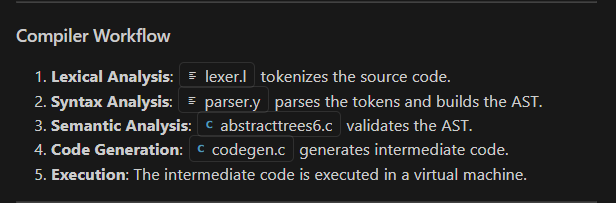
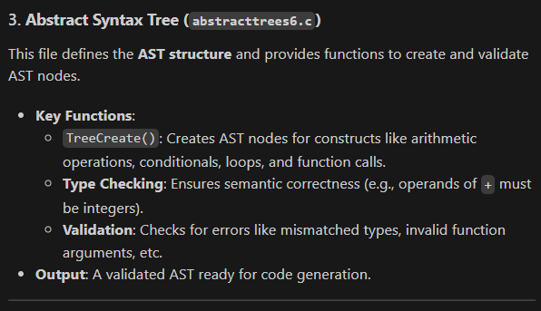
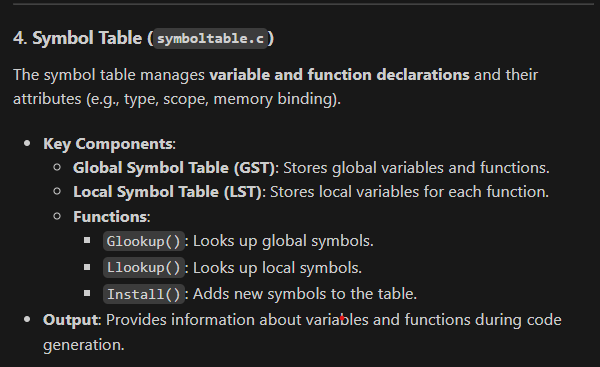
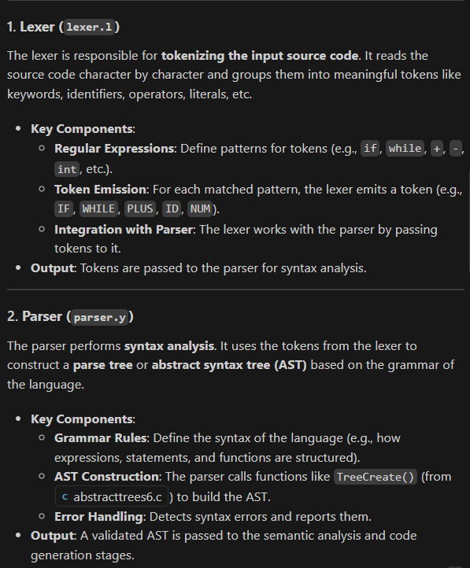
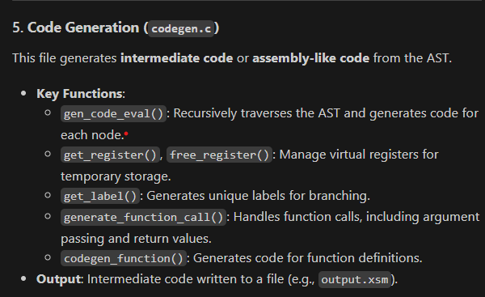

# SIL Compiler

This is a simple compiler for a language called SIL (Simple Integer Language) implemented in C using Lex and Yacc. The compiler translates source code written in SIL into an intermediate representation.

## Table of Contents

1. [Overview](#overview)
2. [Project Structure](#project-structure)
3. [Compiler Workflow](#compiler-workflow)
4. [Key Components](#key-components)
   - [Abstract Syntax Tree](#abstract-syntax-tree)
   - [Symbol Table](#symbol-table)
   - [Lexical Analysis](#lexical-analysis)
   - [Parsing](#parsing)
   - [Code Generation](#code-generation)
5. [Features of SIL](#features-of-sil)
6. [How to Compile and Run](#how-to-compile-and-run)
7. [Example Programs](#example-programs)

## Overview

SIL is a simple programming language that supports:
- Integer and boolean data types
- Global and local variable declarations
- Arrays
- Functions with pass-by-value and pass-by-reference parameters
- Control structures (if-then-else, while)
- Arithmetic and logical expressions
- Input/output operations (read, write)

The compiler translates SIL programs into an intermediate representation that can be executed by a virtual machine.

## Project Structure

The project consists of the following key files:

- **abstracttrees6.h/c**: Defines the structure and operations for the Abstract Syntax Tree (AST)
- **symboltable.h/c**: Implements the symbol table for managing variable and function declarations
- **lexer.l**: Lex specification for tokenizing the source code
- **parser.y**: Yacc grammar specification for parsing the tokens
- **codegen.c**: Generates intermediate code from the AST
- **commands.sh**: Shell script to compile and run the compiler

## Compiler Workflow



The compilation process involves the following steps:

1. **Lexical Analysis**: The source code is tokenized by the lexer (implemented using Flex)
2. **Parsing**: The tokens are parsed according to the grammar defined in the Yacc file, creating an AST
3. **Semantic Analysis**: Type checking and other semantic validations are performed
4. **Code Generation**: Intermediate code is generated from the AST

## Key Components

### Abstract Syntax Tree



The AST is defined in `abstracttrees6.h` and implemented in `abstracttrees6.c`. It uses a tree structure where each node represents a construct in the language:

```c
struct Tnode {
    int TYPE;         // Integer, Boolean or Void (for statements)
    int NODETYPE;     // Operator or statement type
    char* NAME;       // For Identifiers/Functions
    int VALUE;        // For constants
    struct Tnode *ArgList; // List of arguments for functions
    struct Tnode *Ptr1, *Ptr2, *Ptr3; // Child nodes
    struct Gsymbol *Gentry; // For global identifiers/functions
    struct Lsymbol *Lentry; // For Local variables
};
```

### Symbol Table



The symbol table is implemented in `symboltable.h` and `symboltable.c`. It maintains information about:

- Global variables and functions (`Gsymbol`)
- Local variables (`Lsymbol`)
- Function parameters (`ArgStruct`)

### Lexical Analysis



The lexical analyzer (`lexer.l`) identifies tokens such as:
- Keywords (if, then, else, while, etc.)
- Identifiers
- Constants (integers, booleans)
- Operators
- Delimiters

### Parsing

The parser (`parser.y`) implements a grammar for the SIL language. It:
- Validates the syntax of the input program
- Builds an AST
- Handles type checking and semantic validation

### Code Generation



The code generator (`codegen.c`) traverses the AST and generates intermediate code. It handles:
- Register allocation
- Memory allocation for variables
- Control flow (if-then-else, while loops)
- Function calls and returns
- Expression evaluation

## Features of SIL

SIL supports:

1. **Data Types**:
   - Integer
   - Boolean

2. **Declarations**:
   ```
   decl
       integer x, y, arr[10];
       boolean flag;
   enddecl
   ```

3. **Functions**:
   ```
   integer function(integer a, boolean &b) {
       // Function body
       return value;
   }
   ```

4. **Control Structures**:
   ```
   if (condition) then
       // statements
   else
       // statements
   endif;
   
   while (condition) do
       // statements
   endwhile;
   ```

5. **Input/Output**:
   ```
   read(x);
   write(expression);
   ```

6. **Expressions**:
   - Arithmetic: `+`, `-`, `*`, `/`, `%`
   - Relational: `>`, `<`, `==`, `>=`, `<=`, `!=`
   - Logical: `&&`, `||`

## How to Compile and Run

1. Make sure you have the following installed:
   - Lex/Flex
   - Yacc/Bison
   - GCC

2. To compile and run the compiler:
   ```bash
   chmod +x commands.sh
   ./commands.sh input_file
   ```

   The `commands.sh` script performs the following operations:
   ```bash
   yacc -y -d parser.y
   flex -w lexer.l
   gcc -g -w y.tab.c lex.yy.c
   ./a.out < "$1"
   ```

3. The compiler will generate an intermediate code file named `intercode`.

## Example Programs

### Factorial

```
decl
    integer factorial(integer n);
enddecl
integer factorial(integer n){
    decl 
        integer result;
    enddecl
    begin
        if(n == 1) then
            result = 1;
        else
            result = n * factorial(n-1);
        endif;
        return result;
    end
}
integer main(){
    decl
        integer a;
    enddecl
    begin
        read(a);
        write(factorial(a));
        return 1;
    end
}
```

### Prime Number Check

```
decl
    integer prime(integer n), g;
enddecl
integer prime(integer n)
{
    decl
        integer f, ret;
    enddecl
    begin
        f = 2;
        while ((f < n) && (n%f != 0)) do
            f = f + 1;
        endwhile;
        if(f == n) then
            ret = 1;
        else
            ret = 0;
        endif;
        return ret;
    end
}
integer main()
{
    decl
        integer i, check;
    enddecl
    begin
        read(g);
        i = 2;
        while(i <= g) do
            check = prime(i);
            if (check == 1) then
                write(i);
            endif;
            i = i + 1;
        endwhile;
        return 0;
    end
}
```

### Quicksort

The repository also includes a quicksort implementation in SIL that demonstrates the use of arrays and recursive functions.

For more examples, refer to the sample programs in the repository: `factorial`, `maximum`, `paramsRef`, `prime`, `quicksort`, `swap`, and `testfunction`.

